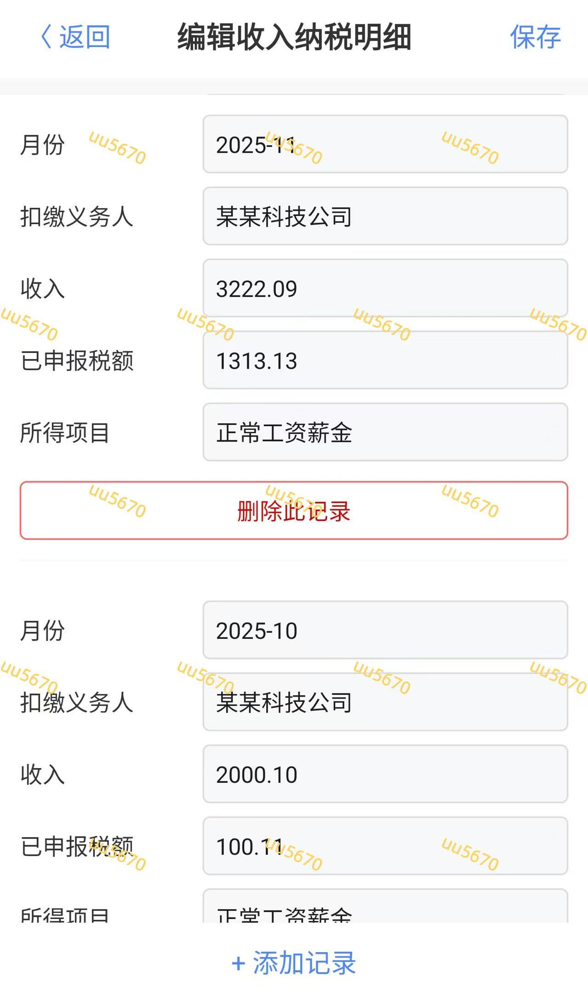

# 仿个税app界面模拟器
仅用于学习演示、界面参考、技术交流。
非官方软件，无真实税务功能。

## 软件截图
### 软件截图1

### 软件截图2

### 软件截图3

## 下载安装
[点击下载安卓app](https://gitee.com/jackwjc/personal-income-tax-simulator/releases/download/v1.0/app-release.apk)
 暂时不支持苹果，可以在PC端使用雷电模拟器运行安卓app [点击下载雷电模拟器](https://lddl01.ldmnq.com/downloader/ldplayerinst9.exe?n=ldplayer9_ld_6000_ld.exe)
## 使用方式
安装后点击购买，在平台购买卡密，输入卡密激活即可使用本软件。
- 激活码一次性使用
- 激活后立即失效
- 一机一码，绑定设备
- 软件更新方法：断网打开app，此时进入验证界面，过几秒联网，点击检查更新，如果有新版本则下载，卸载原有安装包，重装新版，如果不想更新直接关闭软件重新进入即可。

## 演示视频
[点击观看app演示视频](https://www.bilibili.com/video/BV1Asd9BwExD)

## 如果卡密购买不了可以联系本人 联系 QQ：2132718856
[点击联系 QQ](http://wpa.qq.com/msgrd?v=3&uin=2132718856&site=qq&menu=yes)  
